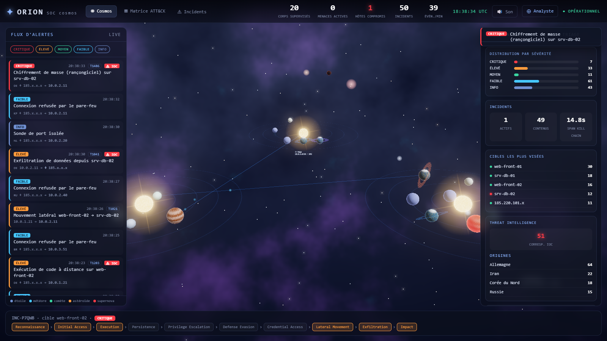
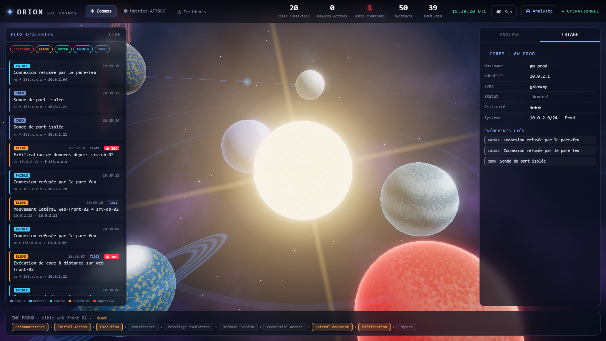
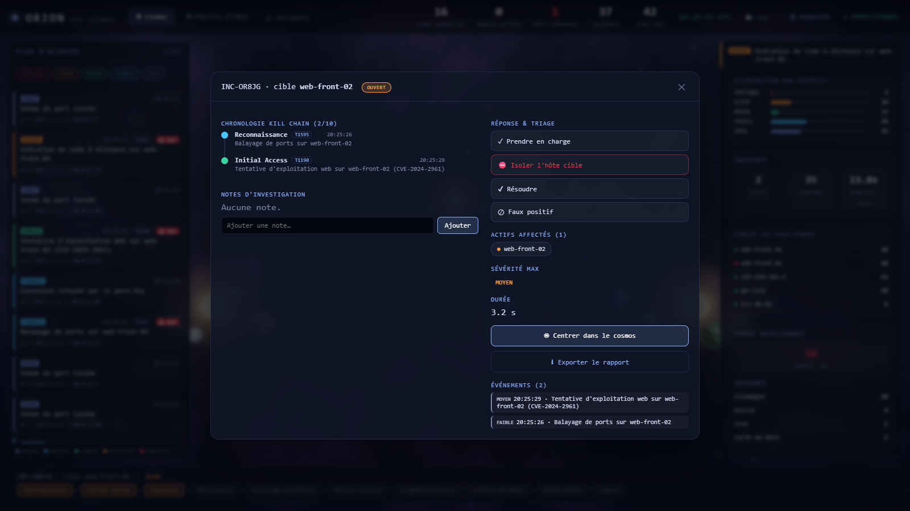
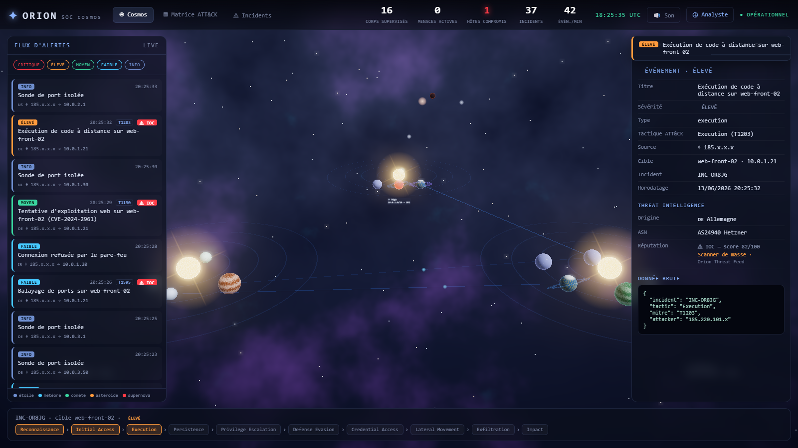
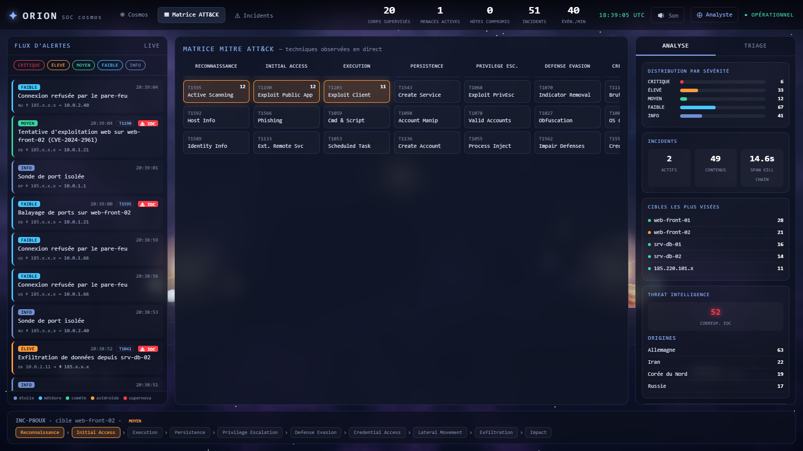
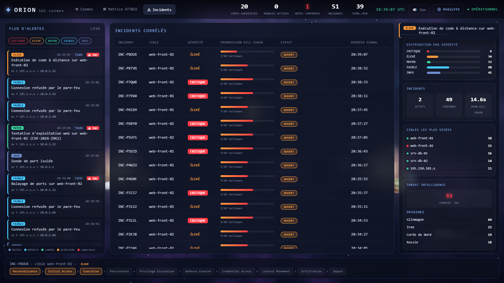
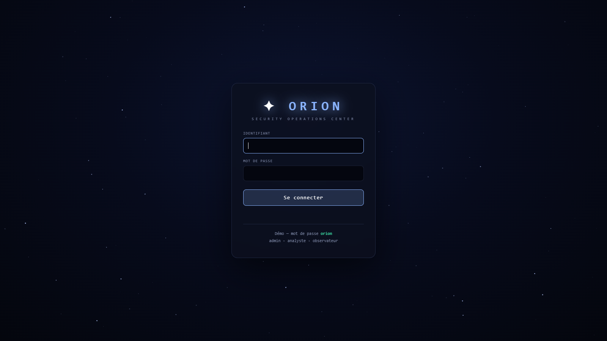

<div align="center">



<br/>

**The first SOC where your network becomes a living cosmos.**
Every asset is a celestial body · every flow a trajectory · every threat a comet streaking in.

<br/>


<br/>


**[Features](#-features) · [Quick start](#-quick-start) · [Architecture](#-architecture) · [API](#-integration--api) · [Preview](#-preview) · [Roadmap](#-roadmap)**

</div>

---

## 📖 About

**Orion** is a next-generation **SOC (Security Operations Center)** that reinvents security
monitoring: instead of tables and logs, your network becomes a **living 3D cosmos** where every
asset is a celestial body and every threat a comet. Under the interface, a real operational
engine — real-time multi-source ingestion, incident correlation, **MITRE ATT&CK** mapping,
**threat intelligence**, **SOAR** response, persistence, and **authentication / RBAC /
multi-tenant** — all deployable in a **single command**, with **zero runtime dependencies**.
Built to sit **on top of** your existing SIEM/EDR and give it the situational awareness and the
"wow" no other tool offers.

---

> **SOCs show tables and packets. Orion shows a sky — one that means something.**
> Beneath the beauty lies a real monitoring tool: real-time ingestion, incident correlation,
> MITRE ATT&CK kill chains, threat intelligence and SOAR response. The cosmos layer is what
> sets you apart from the competition; the engine underneath is what makes it sellable.

<br/>

## 🛰️ Why Orion

| | |
|---|---|
| 🪐 **Unmatched situational awareness** | A 3D cosmos where the state of your whole network reads at a glance. A planet turning red = a compromised host. A supernova = a critical incident. |
| 🎯 **A real SOC, not a screensaver** | Alert feed, triage, incident correlation, live ATT&CK matrix, analytics, threat intel — every pixel carries operational meaning. |
| 🔌 **Plugs into any infrastructure** | Point your SIEM / IDS / EDR at one URL. Format auto-detected. Zero client-side code. |
| 🔐 **Enterprise-ready** | Authentication, **RBAC** (admin/analyst/viewer) and **multi-tenant** data isolation — sellable to multiple clients. |
| ⚡ **One-command deployment** | `node server.js`. Zero runtime dependencies, a single database file. |

<br/>

## 🪐 Preview

<div align="center">

| Real-time cosmos | System close-up |
|:---:|:---:|
|  |  |
| **Incident console (workflow + response)** | **Threat Intelligence** |
|  |  |
| **MITRE ATT&CK matrix (live)** | **Correlated incidents** |
|  |  |
| **Sign-in** | |
|  | |

</div>

<br/>

## ✦ Features

### 🌌 Cosmos visualization
- Cinematic **Three.js / WebGL** rendering: bloom, ACES tone mapping, vignette
- **5 procedural planet types** (terran with city lights, gas giant, ice, ocean world, rogue volcanic)
- **Solar systems = network segments**, concentric orbits, stars with coronas
- Living data traffic, comets/asteroids with trails, supernova on critical incidents
- Cinematic camera intro, boot sequence, synthesized **sound** (toggle)

### 🎯 Operations center
- **3 views**: Cosmos · live MITRE ATT&CK Matrix · Correlated incidents
- Filterable alert feed, **toasts**, real-time KPIs, UTC clock
- **Analytics** panel: severity distribution, top targets, kill-chain span, sparkline
- **Command palette** `Ctrl/Cmd+K`, analyst mode, **report export** (Markdown)

### 🌍 Threat Intelligence
- Automatic enrichment of external actors: **geolocation, ASN, IOC reputation** (score + categories)
- Surfaced in the feed (flag + ⚠ IOC badge), triage and analytics

### ⛔ Workflow & response (SOC console)
- Acknowledge · assign · resolve · false positive · **investigation notes**
- **SOAR containment**: isolate the target host → it goes offline in the cosmos
- Statuses **persisted** and **synced live** across every workstation

### 🔐 Security & enterprise
- **Session authentication** (HttpOnly cookie, scrypt-hashed passwords)
- **RBAC**: `admin` · `analyst` · `viewer` — actions and containment restricted to analysts, account management to admins
- **Multi-tenant**: events, incidents and the SSE stream **isolated per organization**
- Toggleable for demos: `ORION_AUTH=off node server.js`

### 📦 Platform
- **SQLite persistence** (history, investigation, compliance) + backfill on load
- Full **REST API** + **universal ingestion** `POST /ingest`
- **Dynamic topology**: discovered assets appear live

<br/>

## ⚡ Quick start

```bash
node server.js
```

Then open **http://localhost:3000**. Nothing to install (Node 18+, **22+ required** for native SQLite).
The simulator starts on its own: background traffic, full kill chains, asset discovery.

**Sign-in (demo)** — password `orion`: `admin` · `analyste` · `observateur`.

```bash
ORION_AUTH=off node server.js                          # disable auth (visual demo)
ORION_SEED_PASSWORD=… ORION_API_KEY=… node server.js   # harden for production
```

> 💡 In the UI: let the camera intro fly in, toggle 🔊 sound, hit `Ctrl+K`, open an incident and export its report.

<br/>

## 🌌 Architecture

```
 Security sources  ──►  INGESTION  ──►  [ Orion Domain Model ]  ──►  COSMOS render
 (SIEM/IDS/EDR/        (normalize)        Body · Flux · Event · Zone    (Three.js)
  Suricata/sim)                           ▲  THE SINGLE CONTRACT  ▲
                                          │
                              Persistence · API · Threat Intel · Workflow · Auth
```

The **Orion Domain Model** is the only shared vocabulary. The renderer never reads raw data;
ingestion never renders. Swap a source or the rendering engine without touching the rest —
that's what makes Orion modular and sellable.

| Layer | Files |
|---|---|
| Domain model + simulator | `sim/orion-model.js`, `sim/simulator.js` |
| Real-source adapter (Suricata) | `sim/adapters/suricata.js`, `sim/samples/eve.sample.jsonl` |
| Persistence (native SQLite) | `sim/db.js` |
| Threat intelligence (geo + IOC) | `sim/threatintel.js` |
| Server (SSE + API + ingestion + auth/RBAC/multi-tenant) | `server.js` |
| Sign-in page | `web/login.html` |
| Cosmos renderer (Three.js, bloom/vignette, shaders) | `web/cosmos.js`, `web/sound.js` |
| SOC HUD (views, matrix, incidents, analytics, palette) | `web/hud.js`, `web/index.html`, `web/styles.css` |
| State + analytics | `web/store.js` |

<br/>

## 📡 Integration & API

### Universal ingestion — point any tool at Orion

```bash
# Suricata EVE JSON alert (auto-detected)
curl -X POST http://localhost:3000/ingest -H 'content-type: application/json' -d '{
  "event_type":"alert","src_ip":"45.83.12.9","dest_ip":"10.0.2.10","proto":"TCP",
  "alert":{"signature":"ET SSH Brute Force","category":"Attempted Admin","severity":1,
           "metadata":{"mitre_technique_id":["T1110"]}}}'

# Native Orion event
curl -X POST http://localhost:3000/ingest -H 'content-type: application/json' -d '{
  "severity":"high","type":"alert","src":"external","dst":"host-10.0.3.99",
  "title":"Anomalous admin login","mitre":"T1078"}'
```

Secure it: `ORION_API_KEY=secret node server.js` → add `-H 'x-api-key: secret'`.

| Route | Response |
|---|---|
| `GET /api/health` | status, clients, stats |
| `GET /api/events?limit=N` | latest events |
| `GET /api/incidents` | correlated incidents |
| `GET /api/incidents/:id` | one incident + its events |
| `GET /api/stats` | severity, IOC matches, totals |
| `POST /ingest` | ingestion (Suricata EVE or native event) |
| `POST /api/incidents/:id/action` | `ack` · `assign` · `resolve` · `false_positive` · `reopen` · `note` · `contain` |

<br/>

## 🔭 Real data — Suricata adapter

```bash
EVE_FILE=sim/samples/eve.sample.jsonl node server.js
```

The `source → Orion Domain Model → cosmos` pipeline is identical to the simulator.
Adding a source (Zeek, NetFlow, Wazuh…) = writing a normalizer like `sim/adapters/suricata.js`.

<br/>

## 🗺️ Roadmap

- [x] Cinematic cosmos visualization
- [x] Operations center (3 views, feed, analytics, palette)
- [x] Live MITRE ATT&CK matrix + incident correlation
- [x] SQLite persistence + REST API + universal ingestion
- [x] Threat intelligence (geo + IOC)
- [x] Incident workflow + SOAR response (containment)
- [x] Dynamic topology (asset discovery)
- [x] Authentication · RBAC · multi-tenant
- [ ] SSO (OIDC/SAML) · in-app account management UI
- [ ] Live IOC / GeoIP feeds (MaxMind, MISP, AbuseIPDB)
- [ ] Advanced analyst fields (identity, process, SLA)
- [ ] Extended SOAR playbooks + ticketing integration

<br/>

## 🧭 Claude Code skills

The project ships `.claude/skills/orion-*` skills (cosmology/lore, rendering, ingestion,
workflow) so the agent knows Orion by heart at every session.

<br/>

## 📜 License

**Proprietary** — © 2026 Ilyes Staili. All rights reserved. Source-available for evaluation.
Commercial use under license. See [LICENSE](LICENSE).

<div align="center">
<br/>

**✦ ORION** — *the network becomes a cosmos*

</div>
